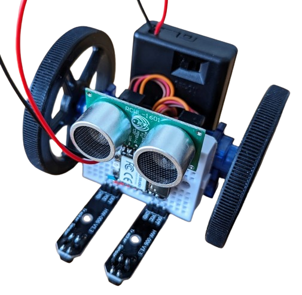

# Breadboard Bot

BreadboardBot is an educational robotics platform that is:

* **Cheap**: the cost of parts is under $20 on AliExpress as of 2023.
* **Easy to build**: you basically need to stick two servo motors and a battery to the back of a breadboard.
* **Easy to program** thanks to [CircuitPython](https://circuitpython.org/).
* **Educational**: in its most basic form it is a programmable line-follower robot with a distance sonar sensor. 
* **Creatively extensible**: you can plug a variety of cheap sensors or actuators and enable your robot to play music, show images on a screen, measure temperature, be remotely controlled from your smartphone and more. You can also upgrade the microcontroller to add Wifi, camera and microphone!

# License
* Any original code in the project is MIT-licensed. The codebase also includes [CircuitPython libraries](https://github.com/adafruit/circuitpython), which are also MIT-licensed.
* Documentation and instructions are CC-BY-NC-SA.
