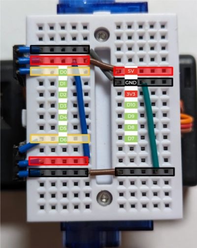

# Assembly

### 1. Prepare the battery box connector

| **Fancier option** (if you have a crimper tool)         | **Simpler option**                                      |
| ------------------------------------------------------- | ------------------------------------------------------- |
| Crimp a 3-way female dupont connector as follows.       | Solder a 2-pin male pinheader                           |
|  |  |

### 2. (Optional) Test the servos

If you have a servo tester, it is worth testing the servos before attaching them to the breadboard.

 

### 3. (Optional) Drill 2mm holes in the servos

Drill a 2mm hole in the middle of the side of one of the servos. E.g. on the side that has no sticker:

Then repeat the same for the second servo, but a different side (e.g. the side with the sticker. Remove it first, of course):

### 4. Attach the servos to the back of the breadboard

* If you want to bolt the motors to the breadboard (i.e. you did not skip the previous step), then proceed as follows:

  Peel the covering paper partially from the back of the breadboard. Push a 2mm bolt through, start screwing it into the hole made in the previous step. Stick the motor to the back, aligning it with the side of the breadboard, then tighten the bolt. Do not overtighten, though.

  
  
  

  Attach the second motor in the same manner, symmetrically:

  
  

* If you do not plan to use bolts, then just stick the motors carefully to the back, as shown on the image above.

### 5. Hot glue the servo connectors to the side of the breadboard

Make sure the connectors align correctly, as shown on the image below. The left motor's connector should align with holes 3-4-5 (counting from the left side). The right motor's connector should align with holes 4-5-6 (counting from the right side). The grounds of both connectors must be *on the outside*.

### 6. Pack the servo wires between the motors

Pull the wires down through the space between the motors, then fold back and forth twice and stick a ~2x3cm patch of double-sided tape to close.

### 7. Screw the wheel adapters onto the motors

If you are using lego-style wheels, this is a good time to screw on the wheel adapters.

### 8. (Optional) Stick the caster ball to the battery box

TODO: Make a photo.

### 9. Stick the battery to the motors

Attach the wheels, put the robot on the table so that the breadboard is vertical and slightly slanted forward, then peel the two-sided tape on the back and stick the battery box so that its bottom (or the caster ball, if you use it) would touch the floor. Make sure you stick the battery with the switch on the front and the cover on the back.

### 10. Wire the breadboard

Wire the breadboard as follows:

Your breadboard wiring kit will probably have different colored wires, so, for the reference, here are the sizes of the wires used in the image above (and in the examples documentation later):

The idea here is to route 5V and GND between the servos and the respective MCU pins, and connect the servo signal wires to pins D0 and D6. The ground is routed through the right side of the breadboard to support the line tracker sensor in the first example later.

If you went for the "fancy" battery connector, plug a 15mm pin header as follows. Supergluing it in place is a good idea.

The aim of this is to reduce the chances of connecting the battery incorrectly, which is one of the easiest ways of destroying the MCU in this kit.

If you are building the robot for yourself, you might not bother and simply take extra care to plug the battery in the right spot, but if you plan to use it to teach your kids, for example, do consider any ways of making the connector more foolproof.

I am pretty sure there could be an even more foolproof connector option here - if you come up with a good idea, drop it in the issues section of this Github repository.

### 11. Prepare the microcontroller

* Download the [CircuitPython 7 firmware](https://adafruit-circuit-python.s3.amazonaws.com/bin/seeeduino_xiao_rp2040/en_GB/adafruit-circuitpython-seeeduino_xiao_rp2040-en_GB-7.3.3.uf2).
    * Yes, it is an old version, but that is what the current code has been tested with and I never bothered trying to upgrade so far. Feel free to try newer versions.
* Hold the "BOOT" button on the Xiao RP2040 and while holding it connect it via USB to your computer. A new external drive named `RPI2-RP2` should appear. Copy the `.uf2` file downloaded in the previous step to this drive. When download completes, the microcontroller restarts and an external drive named `CIRCUITPY` should appear.
  * You can read more about this flashing process [here](https://wiki.seeedstudio.com/XIAO-RP2040-with-CircuitPython/).
* Copy the contents of the [code/examples](https://github.com/konstantint/BreadboardBot/tree/main/code/examples) directory to that drive.

If all went fine, you should observe that the newly uploaded program first blinks the green LED and then starts showing a rainbow effect on its RGB LED.

### 12. Plug the microcontroller into the breadboard and test with USB power

Plug the microcontroller as follows:

The signal wires of the servos should connect to the very first (D0) and last (D6) pins on the left side of the MCU. To test the connection without risking burning the controller, *do not* plug in the battery yet. Instead, connect the MCU to the computer via USB (do not attach the wheels yet either). You should see the same rainbow animation program execute as in the previous step, but now the motors will turn on and off intermittently.

### 13. Plug in the battery

Now you can detach the USB cable, attach the wheels and plug in the battery connector. This is the final moment when you can burn your MCU if you connect things incorrectly. Make sure the battery box is switched off and its red and black wires attach to the following rows of the breadboard:

Once verified the connection is correct, you can switch on the battery box and let the robot roam your room [like that](https://www.youtube.com/watch?v=gX162mp3CMo).

Congratulations! Now let us extend the robot [to do more fun things](examples.md).
