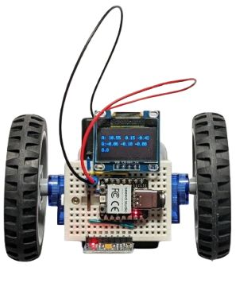

# BreadboardBot example projects

* [Basic line follower](examples/line_follower.md)
* [Sonar-based obstacle-avoiding line-follower](examples/line_follower_sonar.md)
* [Sonar-based obstacle-avoiding line-follower with a button & a buzzer](examples/line_follower_sonar_button_buzzer.md)
* [Line follower with an OLED face](examples/line_follower_oled.md)
* [Line follower with an OLED face that shows temperature and humidity](examples/line_follower_oled_dht11.md)
* [Line follower with an OLED screen that shows current date and time](examples/line_follower_oled_ds3231.md)
* [IR-based obstacle-avoiding line-follower with an OLED face](examples/line_follower_oled_ir.md)
* [Remote control using Bluetooth serial (HC05/06)](examples/oled_bluetooth.md)
* [Web-based control over Wifi & camera (ESP32S3 [Sense])](examples/esp32s3_http_control.md)

Examples pending documentation:

* MPU6050 accelerometer & self-balancing

  

* Joystick ([video](https://www.youtube.com/shorts/SHxjkkJ96kc))
* Microphone
* PIR sensor
* Two communicating robots
