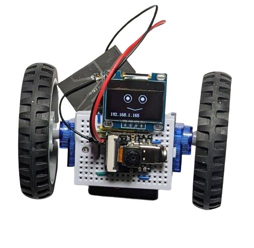

# Web-based control & camera (ESP32S3 Sense)

This example requires the use of the [Xiao ESP32S3](https://www.seeedstudio.com/XIAO-ESP32S3-p-5627.html) or (for camera functionality) the [Xiao ESP32S3Sense](https://www.seeedstudio.com/XIAO-ESP32S3-Sense-p-5639.html) microcontroller.

* **Wiring**

  This example uses the [OLED](line_follower_oled.md) wiring, without the line sensors. You can also comment out the OLED functionality in the code and just use the [base assembly](../assembly.md) wiring.

* **Program:**

  The ESP32S3 needs to be flashed with CircuitPython 8 as described [here](https://wiki.seeedstudio.com/XIAO_ESP32S3_CircuitPython/), except you should use the `Espressif - ESP32S3-DevkitC-1-N8R8` image for camera support.

  Next, copy over the `lib` directory from from [code/examples_8](https://github.com/konstantint/BreadboardBot/tree/main/code/examples_v8). Make sure that you copied `settings.toml` over - without it the camera crashes with an out of memory error.

  Then edit the `wifi_config.py`, specifying the correct Wifi SSID and password.

  Finally, edit `code.py` to do `import esp32s3_http_control` or `import esp32s3sense_http_control_cam` respectively.

* On boot the microcontroller will show a web server, reporting its IP in both the serial debug message and on the OLED screen. You can connect to that address and use the forward/backward/left/right/stop buttons to control the motors and view the live camera image.

