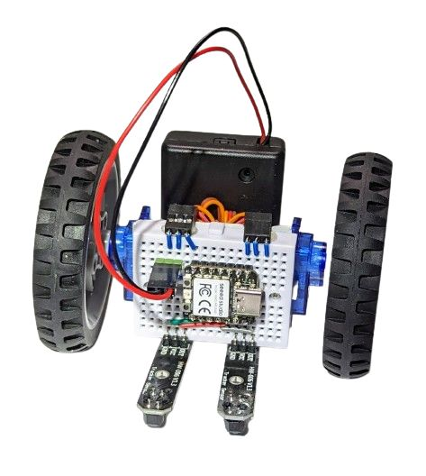
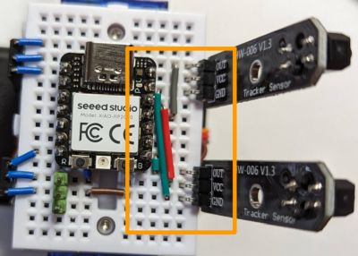

# Basic line follower

* **Wiring**

  Starting from the [base assembly](../assembly.md), plug two line tracking sensors and wire them to the microcontroller using three extra wires (S1, S4, S6) as follows:

  

  Note that this wiring is not ideal, as, in its strive for simplicity, it powers the left line sensor from 5V. This sensor then sends the 5V positive signal to the microcontroller's D10 pin. GPIO pins of the Xiao RP2040 are not designed to be 5V-tolerant. However, the setup seems to work in practice, at least for short test sessions. Note that if you use rechargeable AAA batteries, the "5V" will actually be around 4V, which is closer to safe voltage limits (and thus better).
* **Program:** Change `code.py` to be just `import ex02_line_follower`.
* The resulting robot should behave somewhat [like that](https://youtu.be/DHixDNT65I0).
