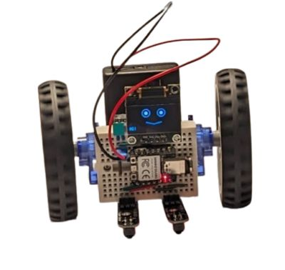
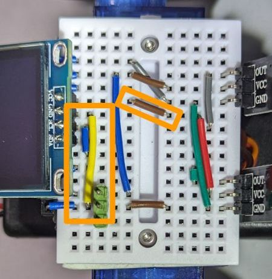

# Line follower with an OLED face

* **Wiring**

  Starting from the [line follower wiring](line_follower.md), add three wires: S7 to connect GND to D2, S3 to connect 3V3 to D1, S2 to connect D5 to D3. The latter is needed to make sure that the SCL and SDA pins of the OLED screen connect specifically to the SCL and SDA pins of the microcontroller (D5 and D4 respectively).

  

  Note that different models of 0.96" OLED screens have different orders of pins and might need the wiring adapted (e.g. GND-VCC-SCL-SDA is quite popular, which is different from the VCC-GND-SCL-SDA, shown above).

  The OLED takes the space that would be necessary to plug in the sonar, so you cannot have both (but you can still get obstacle avoidance using an [IR proximity sensor](line_follower_oled_ir.md). The wiring shown here is also incompatible with the button attachment used in the [Sonar line follower with button](sonar_line_follower_button_buzzer.md) example (you need the D1 pin for the display here). If you need both the display and a button, you would need to rewire the button to a different input pin.

* **Program:** Change `code.py` to be just `import ex05_line_follower_oled`.
* The resulting robot is just the basic line follower, but with a funny, minimally animated face.
