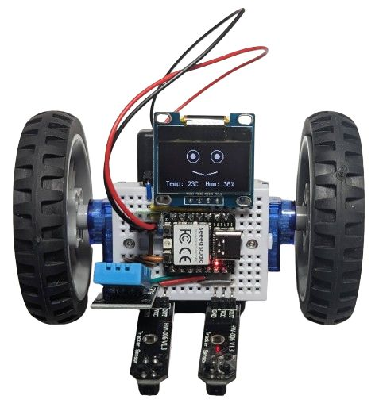
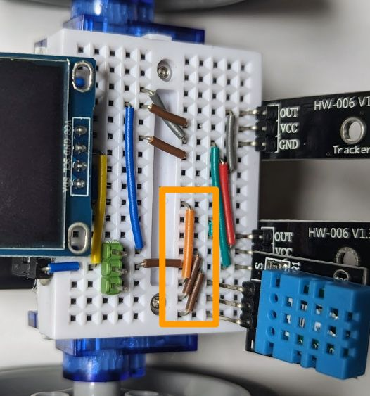

# Line follower with an OLED face and a DHT11 temperature & humidity sensor

Because why not?

* **Wiring**

  Starting from the [line follower with OLED](line_follower_oled.md) example, add three wires to connect the three pins of DHT11 to GND, 3V3 and D8 respectively.

  

* **Program:** Change `code.py` to be just `import ex06_line_follower_oled_dht11`.
* The resulting robot is just the basic line follower, but with a funny face on the screen that also somewhy shows the current temperature and humidity.
