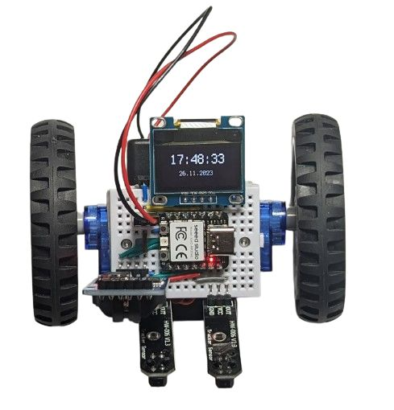
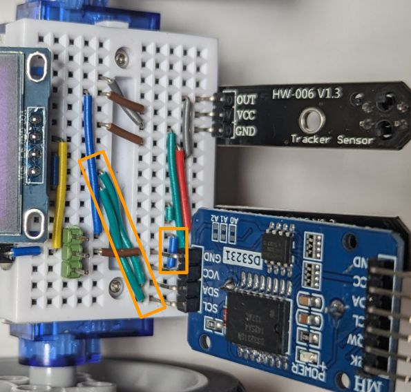

# Line follower with an OLED screen and a DS3231 real-time clock

Because why not?

* **Wiring**

  Starting from the [line follower with OLED](line_follower_oled.md) example, connect the DS3231 module to SDA, SCL, GND and 3V3 as follows (for example):

  

* **Program:** Change `code.py` to be just `import ex07_line_follower_oled_ds3231`.
* The resulting robot is just the basic line follower that shows the current date and time (which can survive poweroffs as long as the dedicated DS3231 battery lasts).