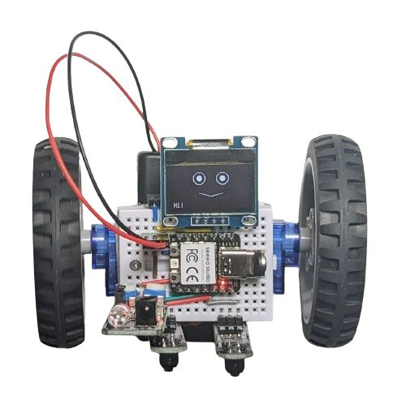
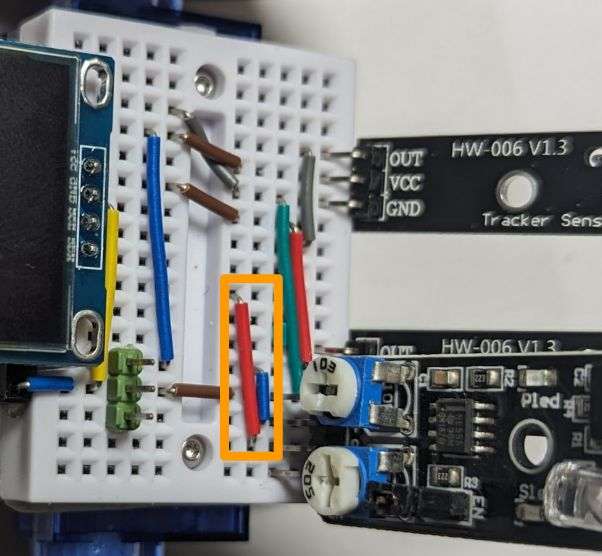

# Line follower with an OLED face and an IR proximity sensor

When using a display there is no place for a sonar, but there is space to plug in an IR obstacle avoidance sensor.

* **Wiring**

  Starting from the [line follower with OLED](line_follower_oled.md) example, connect the IR proximity sensor to GND, 3V3 and D8 using S2 and S6 wires:

  

* **Program:** Change `code.py` to be just `import ex08_line_follower_oled_ir`.
* The resulting robot is a version of the [line_follower_sonar](line_follower_sonar.md) example, just with the IR proximity sensor instead of the sonar. Here's a [video](https://youtu.be/CE_nFJj4xOg). Fun fact: it is not straightforward to film this robot with a smartphone as it turns away as soon as you point your smartphone camera on it - the IR sensor reacts to the IR LED used the smartphone.