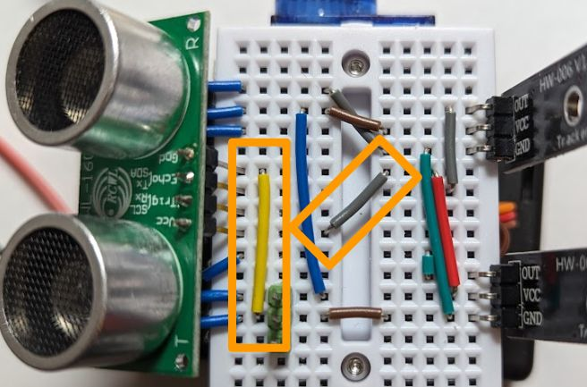

# Sonar-based obstacle-avoiding line follower

* **Wiring**

  Starting from the [line-follower](line_follower.md) wiring, plug in the RCWL-1601 sonar and connect its VCC and GND pin appropriately using two extra wires (S4, S7) as follows:

  

* **Program:** Change `code.py` to be just `import ex03_line_follower_sonar`.
* The resulting robot should behave somewhat [like that](https://youtu.be/cBlWqL9eYWU). Note that you can hear the normally inaudible sonar working in the recording.
