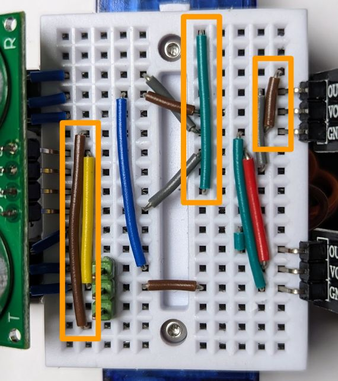

# Sonar-based obstacle-avoiding line follower with a button and a buzzer

* **Wiring**

  Starting from the [sonar line-follower](line_follower_sonar.md) wiring, add an S10 wire to pin D1 and an S3 and S8 wires to GND & D9 as follows: 

  

  Then plug the button between the existing GND rail and the newly routed D1 connection. Plug the buzzer between the newly routed GND and D9 connections:

  

  The arrows point to the breadboard rows that must be connected by the button and the buzzer. The buzzer has a "plus" side (marked by a small "plus", highlighted with an orange square in the picture). Make sure it is the side that gets routed to the pin (not GND).

* **Program:** Change `code.py` to be just `import ex04_line_follower_sonar_buzzer_button`.
* The resulting robot's behavior is the same as that of the previous "Sonar line follower" with a few additions:
  * It beeps on start-up.
  * It indicates the distance via beeps (put your hand closer to the sonar and it will beep more frequently).
  * If you click the button, it will stop and play a short melody.
  * Here's a [video](https://youtu.be/FUKQwfPJc14). As in the video for the previous example, you can hear the otherwise inaudible sonar in the recording.
