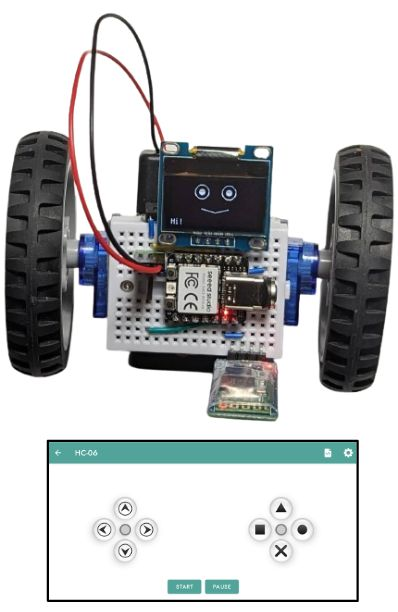
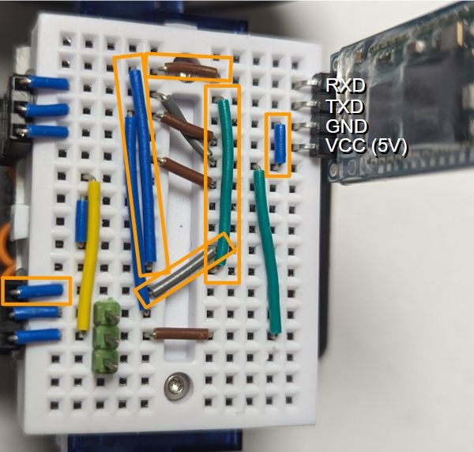

# Remote control via Bluetooth serial (HC05/06)

* **Wiring**

  Start from the [OLED example](line_follower_oled.md) and remove all wiring for the line tracker sensors on the right of the breadboard. We would like to use the hardware UART to communicate to the HC06 transceiver, which means we need to connect it to MCU pins D6 & D7. The original assembly wired the right motor's signal to D6 already - we will need to rewire it to D8 as shown below:

  

* **Program:** Change `code.py` to be just `import ex09_oled_bt`.
* **Usage:** Install the [Arduino Bluetooth Controller app](https://play.google.com/store/apps/details?id=com.giristudio.hc05.bluetooth.arduino.control), launch it, pair to the `HC-06` device, open the "Gamepad" screen, and try steer your robot. 
  
  Note that there are many "Bluetooth serial controller" apps out there and pretty much any one will do that can be configured to send predefined single-character commands (`F` for forward button down, `B` backward, `L` left, `R` right, `0` any button up). The example code also controls the eyes via the `S` (square), `C` (circle) and `T` (triangle) buttons.
  
  It is easy to modify the code to support any other commands as well.