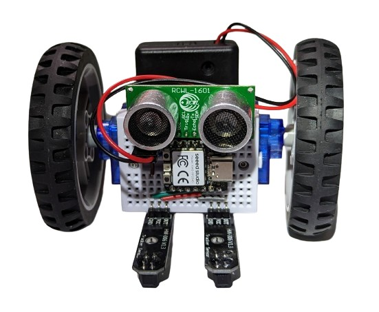

# BreadboardBot

BreadboardBot is a mini-breadboard with a small microcontroller plugged into it and two servo-motors with a battery stuck to the back.

To put it differently, it is **an educational robotics platform** that is:

* **Cheap**: the cost of parts is under $20 on AliExpress as of 2023.
* **Easy to build**: it really is just two servo motors and a battery stuck to the back of a breadboard.
* **Easy to program** thanks to [CircuitPython](https://circuitpython.org/).
* **Fun**: even in its most basic form it is already a cute programmable line-follower robot with an ultrasonic distance sensor. 
* **Creatively extensible**: you can plug a variety of sensors or actuators into it, enabling your robot to play music, show images on a screen, measure temperature, be remotely controlled from your smartphone and more. You can also upgrade the microcontroller to add Wifi, camera and microphone, learning some web-development and machine learning along the way!

To get started with the BreadboardBot you need to:

1. Order the necessary [parts](parts.md).
2. [Assemble](assembly.md) them.
3. Check out the [fun things](examples.md) you can do with your robot. 

Leave your feedback or propose new ideas as issues in [this repository](https://github.com/konstantint/BreadboardBot).

# License
* Any original code in the project is MIT-licensed. The codebase includes [CircuitPython libraries](https://github.com/adafruit/circuitpython), which are also MIT-licensed.
* This documentation and instructions are CC-BY-NC-SA.
