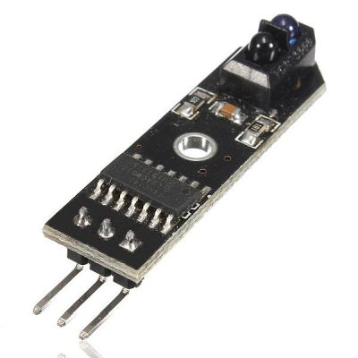

# Parts and tools

To build the BreadboardBot you will need to obtain the following parts and tools.

## Body

| **Image**&nbsp;&nbsp; | **Component** | **Price** | **Notes** |
| --------------------- | ------------- | --------- | --------- |
|  | [Xiao RP2040](https://www.seeedstudio.com/XIAO-RP2040-v1-0-p-5026.html) | $6 | The Seeedstudio Xiao series includes several microcontrollers with the same, pin-compatible form-factor. Moreover, there are pin-compatible boards from other vendors ([example](https://www.adafruit.com/product/5426)). Quite probably, many of those could be used as a drop-in replacement to the Xiao RP2040 in the BreadboardBot (with appropriate update to the code and, maybe, some wiring changes). This is one of the things that makes the BreadboardBot exciting (e.g. [Xiao ESP32S3 Sense](https://www.seeedstudio.com/XIAO-ESP32S3-Sense-p-5639.html) is a pin-compatible microcontroller with Wifi, Bluetooth, microphone and camera). The current instructions and code, however, are created around Xiao RP2040. It is cheap (do get a few replacements to break), beginner-friendly (due to CircuitPython support, note that not every MCU can act as a USB drive) and quite tolerant to some of the sloppy electrical connections used in the bot (unlike, say, the Xiao SAMD21, it seems). I hope to try BreadboardBot with other MCUs and add relevant code examples.|
|  | [Mini-breadboard](https://aliexpress.com/item/1005006054688190.html) | $0.5 |  |
|  | 2 x [SG90 continuous servo + wheel](https://aliexpress.com/item/33046263381.html) | $6 | The version with lego-style wheels is the most convenient (as you can easily take them off and put back on). Note that the linked servos are not the most reliable and you might want to get a backup or two. |
|  | [3xAAA battery box](https://aliexpress.com/item/1005003772254191.html) | $1 | Make sure you get the one with an on-off switch. |
|  | [Self-adhesive caster ball](https://aliexpress.com/item/1005005159921275.html) | $0.4 | The caster ball is optional. I've yet to find one with the appearance that I like. |

NB: AliExpress links here point to somewhat arbitrarily chosen sellers that I personally used to order the parts. They might become stale or you might be able to find the same components cheaper (for the particular quantity you need) elsewhere. The prices match what I paid when ordering components for 5 kits, including shipping.

## Sensors / actuators

You can plug a variety of breadboard-friendly gadgets into the robot, as long as they don't have too many pins and work with 3.3V power.

The components listed below are just a small selection of things that have been tested so far and are supported by some of the provided code examples.

| **Image**&nbsp;&nbsp; | **Component** | **Price** | **Notes** |
| --------------------- | ------------- | --------- | --------- |
|  | 2 x [Line-tracker sensor](https://aliexpress.com/item/1005003297744025.html)  | $1 | Make sure you get the model with pins ordered OUT, VCC, GND (when the sensor is looking down). |
|  | [RCWL-1601 sonar](https://aliexpress.com/item/1005004215620216.html)  | $1.5 | NB: This is *not* the popular HC-SR04 ("blue") sensor. The blue one requires 5V input, this one works with 3.3V. |
|  | [Passive buzzer](https://aliexpress.com/item/1005006205295709.html)  | $0.2 | There are many options, I've yet to find one that fits the breadboard perfectly. |
|  | Button ([1](https://de.aliexpress.com/item/32834276752.html), [2](https://aliexpress.com/item/32843612610.html))  | $0.05 | There are many options, I've yet to find one that I like best. |
|  | [0.96" SSD1306 OLED](https://aliexpress.com/item/1005005281256695.html)  | $2 | |
|  | [HC06 Bluetooth serial transceiver (4-pin)](https://aliexpress.com/item/1005005648270683.html)  | $2.4 | |
|  | [DHT11 humidity & temperature sensor](https://aliexpress.com/item/1005006223904588.html)  | $0.7 | |
|  | [IR proximity sensor](https://de.aliexpress.com/item/1005005064947064.html)  | $1 | |

## Expendables

You will need some expendable materials to assemble the robot as well as a set of breadboard wires.

| **Image**&nbsp;&nbsp; | **Component** | **Notes** |
| --------------------- | ------------- | --------- |
|   | [Breadboard jumper wire set](https://aliexpress.com/item/1005004530477894.html) |  You will only need 10 or so from the set, but you might find use for others later anyway.
|   | 2 x [M2 bolts](https://aliexpress.com/item/32907505613.html) 5-8mm | The bolts are somewhat optional - you can just stick the motors on the back of the breadboard without them. However, adding the screws makes the construction much more durable. The required length of the bolts depends on whether the head will sink inside the opening.
|   | Hot glue | In theory this can be any glue that will stick servo connectors to the side of the breadboard. I was hoping superglue would work, but it somewhy did not hold at all for me. Hot glue did the job very well. This may depend on the actual plastic used for the breadboard - it seems there are slight variations.
|  | [Two-sided sticky tape](https://aliexpress.com/item/1005005380522382.html) | Any two-sided tape should do, but I really like the linked one (the 30mm-wide one). Worth having at home in general.
|    | [Pin headers](https://aliexpress.com/item/1005003012878518.html) | Firstly, you will definitely need the "usual", male, 11mm headers (2 sets of 7 pins) to solder onto the MCU. In addition, headers for the battery box are needed and there are two options. The "basic" one is to solder two 11mm male pin headers to the battery wires (in this case you might also want to get some heatshrink or insulation wire). A fancier option (less prone to a battery misconnection that can burn your MCU) is to crimp a 3x1 *female* header on the battery wire (you will need a crimper tool for that) and have it plug onto male headers sticking out of the breadboard. For that you will need to get three 15mm male pinheaders.

## Tools

You will need scissors to cut the sticky tape, a screwdriver for screwing the bolts, a hot glue gun (unless you find a different glue for fixing servo connectors on the breadboard) and a soldering iron to solder pinheaders to the MCU. The two additional (optional and perhaps less common) tools that I personally ended up using are:

| **Image**&nbsp;&nbsp; | **Component** | **Notes** |
| --------------------- | ------------- | --------- |
|     | [Hand twist drill](https://aliexpress.com/item/1005005264022948.html) | A small hand-twist drill (which you can get for $3 sometimes) can be quite useful for making the 2mm holes in the servos which you need to then bolt them to the breadboard. You might find different ways of getting those holes or, as mentioned above, simply avoid bolting the motors to the breadboard completely.
|   | [Dupont wire crimper tool](https://aliexpress.com/item/1005005699142549.html) | This is optional and only needed if you want to make a "fancier" battery connector.

## Extras

The absolutely optional but incredibly convenient extra is:

| **Image**&nbsp;&nbsp; | **Component** | **Notes** |
| --------------------- | ------------- | --------- |
|     | [Magnetic, 90-degree twistable USB cable](https://aliexpress.com/item/1005004971580228.html) | Allows you to easily connect to the microcontroller on the breadboard without having to remove the wheels every time.

Once you've gotten all the parts, proceed to [assemble them](assembly.md).